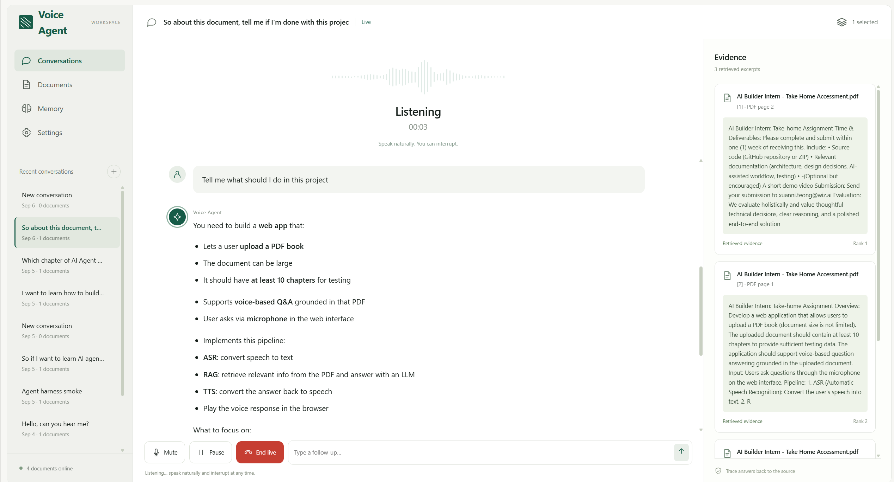

# Voice Agent — Document-grounded RAG with voice

Voice Agent is a local-first, multi-document voice RAG application built for the Wiz AI Builder Intern take-home. Upload PDFs, ask through text or voice, inspect retrieved evidence, and continue a real-time voice conversation.

It is deliberately inspectable: grounded answers cite PDF pages, retrieved excerpts appear in the Evidence panel, document selection is explicit per chat, and the implementation/evaluation trail is recorded in [`EXPERIMENT_LOG.md`](EXPERIMENT_LOG.md).

## Highlights



*Live voice conversation with document evidence and page references alongside the chat.*

- Text PDFs and scanned PDFs: native extraction with local CPU OCR fallback.
- Multi-document RAG: BM25 + embeddings → reciprocal-rank fusion → LLM reranking → cited answer.
- Separate conversations, each with an independent set of selected documents.
- Clickable inline citations that select the matching Evidence card.
- Bounded document-tool agent for indirect requests such as comparisons, recommendations, and study plans.
- Typed questions, reviewable push-to-talk transcription, and continuous WebRTC **Talk live**.
- English, Chinese, and automatic/mixed speech transcription; TTS replies.
- A shared intent/consent gate across typed input, Mic, and Live Call.
- Automatic chat summaries after the 11th user question, plus optional explicit saved details.

## Architecture

```text
PDF / scanned PDF
  -> text extraction + OCR fallback
  -> parent/child chunks
  -> BM25 index + embedding index
  -> RRF fusion -> LLM reranker -> grounded answer + PDF citations

Typed / push-to-talk / Live Call
  -> shared intent + document-consent gate
  -> conversation history + selected documents + long-term summaries
  -> RAG or bounded document-tool agent
  -> answer + Evidence panel + optional TTS
```

FastAPI runs locally and stores conversations in SQLite. `OPENAI_API_KEY` stays in the Python backend; it is never exposed to browser JavaScript. Live Call receives a backend-created WebRTC Realtime session.

## Quick start — Docker (Windows / macOS / Linux)

Install and start [Docker Desktop](https://docs.docker.com/get-started/get-docker/) (Linux can use Docker Engine with Compose). **No local Python or OCR installation is required.**

1. Download this repository using **Code → Download ZIP**, and extract it.
2. Duplicate `.env.example`, name the copy `.env`, and fill in `OPENAI_API_KEY`. Leave other defaults unchanged.
3. Open a terminal in the extracted folder and run:

```sh
docker compose up -d --build
```

Open **http://localhost:8000**, or click port **8000** for the running service in Docker Desktop. The first build downloads dependencies and may take several minutes; later starts reuse the image.

Start with **Documents → Upload PDF**. Use the included Treasury PDF or your own PDF. A fresh installation starts with an empty library and builds indexes on upload; no numbered Python scripts are required.

To copy the template from a terminal: `Copy-Item .env.example .env` in PowerShell, or `cp .env.example .env` on macOS/Linux. Only copy it on first setup, to avoid overwriting an existing key.

```sh
docker compose logs --tail=100 voice-agent  # Inspect startup errors
docker compose down                       # Stop; preserve saved data
docker compose up -d                       # Start again
```

Documents, chats, memories and indexes persist in Docker named volumes across container replacement. `docker compose down -v` erases those volumes; do not use it to stop the app normally. After changing `.env`, run `docker compose up -d --force-recreate`. If port 8000 is occupied, stop the existing Python server or change the host mapping in `compose.yaml` to `127.0.0.1:8001:8000` and open localhost:8001.

The microphone runs in your browser; no audio device passthrough into Docker is needed. Select it in **Settings**, allow browser permission, then use **Mic** or **Talk live**. Your key must have access to the configured models and sufficient API credit. Docker provides a local server, not a public multi-user deployment.

Container build, startup, OCR initialization and persistence checks run in GitHub Actions. Linux amd64 is the automated test platform; other platforms are not claimed as tested until verified.

## Development setup — Python (optional)

### Requirements

- Windows 10/11 and Python 3.11+
- An OpenAI API key; Realtime access is needed only for **Talk live**

### Install

Open PowerShell in this folder:

```powershell
py -3.11 -m venv .venv
.\.venv\Scripts\Activate.ps1
python -m pip install --upgrade pip
python -m pip install -e ".[dev]"
Copy-Item .env.example .env
```

Open `.env` and add your key:

```dotenv
OPENAI_API_KEY=sk-...
```

Model names and retrieval defaults are documented in [`.env.example`](.env.example). Never commit `.env`.

### Run

```powershell
.\.venv\Scripts\python.exe 14_run_backend.py
```

Open [http://127.0.0.1:8000](http://127.0.0.1:8000). Keep PowerShell running; use `Ctrl+C` to stop it. On Windows, [`setup.ps1`](setup.ps1) is also available as a one-click setup shortcut.

## How to use

### 1. Start a chat and select sources

Use **+** in the left sidebar to create a chat. Open **Documents** or **Add documents**, upload PDFs, then tick the files to make them available to that chat.

- Text PDFs are indexed directly; image-only/scanned pages fall back to local RapidOCR.
- There is no application-level upload-size limit. Disk, RAM, parsing time, provider limits, and a deployment proxy may still impose practical limits.
- The current upload scope is PDFs only. DOCX, images, and spreadsheets are not yet accepted.

If a relevant library document is not selected, the Agent identifies only its filename and asks permission. Say “yes” to attach it to the active chat and continue the original question.

### 2. Ask with text

Type a question and choose **Send**. Document answers contain citations; click `[1]`, `[2]`, etc. to highlight the matching right-side Evidence card.

You can ask direct questions or higher-level document tasks:

```text
What does this report say about staff costs?
Based on this book, make me a study plan for an AI-agent role.
Compare the priorities in the selected reports.
```

For indirect tasks the bounded agent can list/search the selected documents and synthesize an answer. It cannot browse the web, edit files, or use arbitrary tools.

### 3. Use push-to-talk Mic

1. Select the physical microphone above the composer.
2. Set English, 中文, or Auto-detect/mixed in **Settings**.
3. Choose **Mic**, speak for at least one second, then stop.
4. The transcript appears in the composer. Review it, then choose **Send**.

If the input level is 0%, allow microphone access in Chrome’s address-bar controls and confirm the Windows input meter. Do not choose a virtual device such as Steam Streaming Microphone unless it is your intended source.

### 4. Use Talk live

Choose **Talk live** for a continuous WebRTC voice session. The Agent listens, retrieves when required, answers aloud, and retains the same chat context.

- **Mute** stops your input; **Pause** pauses Agent response; **End live** closes the session.
- New questions and corrections interrupt the active spoken response.
- Short acknowledgements such as “OK”, “yeah”, and “好啊” are treated as acknowledgements where possible rather than a full interruption.

Use Chrome or Edge on localhost and grant microphone permission.

### 5. Inspect Evidence and Memory

Evidence cards show the exact retrieved excerpts and their PDF pages.

The **Memory** page is primarily **Chat summaries**: after the 11th user question in a chat, the system saves one compact summary linked to that chat. It is editable and deletable. Explicit phrases such as “remember that I prefer concise answers” are still supported and display as **Saved detail**.

## Test and verify

Run the full regression suite:

```powershell
.\.venv\Scripts\python.exe run_tests.py
```

Or run pytest directly:

```powershell
.\.venv\Scripts\python.exe -m pytest
```

Coverage includes retrieval, citations and refusals, conversations, document-consent logic, OCR fallback, voice routing, automatic chat summaries, and frontend integration.

## Reproduce RAG evaluation

The numbered scripts preserve the iteration trail. With the virtual environment active:

```powershell
python 01_inspect_pdf.py
python 02_build_baseline_index.py
python 04_run_baseline_eval.py
python 05_run_bm25_eval.py
python 08_run_rrf_eval.py
python 09_run_llm_reranker_eval.py
python 12_run_answer_eval.py
python 13_run_audited_test_eval.py
```

Evaluation outputs appear in `reports/latest/` and timestamped folders below `reports/runs/`:

```text
summary.md       Human-readable metrics and decisions
summary.html     Browser-friendly result page
predictions.jsonl
failures.csv
run_config.json
```

Use `RAG_EVAL_SPLIT=dev` while tuning. Use `RAG_EVAL_SPLIT=test` only for a frozen held-out comparison. See [`reports/RAG_EVALUATION_REPORT.md`](reports/RAG_EVALUATION_REPORT.md) and [`EXPERIMENT_LOG.md`](EXPERIMENT_LOG.md) for results and trade-offs.

## Project layout

```text
src/treasury_rag/       FastAPI app, RAG pipeline, agent, memory, OCR, provider
web/                    Three-column browser UI, Mic and Live Call client logic
tests/                  Offline regression and integration tests
scripts/                Repeatable verification scripts
eval/                   Gold questions and evaluation data
reports/                Evaluation reports and reproducible run artifacts
14_run_backend.py       Start the browser application
run_tests.py            Run the regression suite
```

## Important limitations

- This is a local development app, not a production deployment: it has no authentication, user isolation, rate limiting, or encrypted at-rest storage.
- OCR can make mistakes with handwriting, tables, equations, unusual fonts, and exact entities/numbers. Inspect Evidence for high-stakes use.
- The Agent only uses documents selected for the active chat. It does not use web search as evidence.
- A chat summary is generated once when a conversation crosses 10 user turns. It is not regenerated on every later turn, avoiding repeated model calls and latency; edit it in Memory if the chat changes direction.
- Deleting a chat removes its messages but retains library files and long-term summaries. Removing a file unselects it everywhere but keeps source/index files for re-upload recovery; neither is secure erasure.
- API calls can incur OpenAI costs. Review configured models in `.env` before indexing large PDFs or running evaluations.

## Change record and documents

All accepted/rejected changes and test traces are in [`EXPERIMENT_LOG.md`](EXPERIMENT_LOG.md). Review copyright and licensing before redistributing sample PDFs; the HM Treasury annual report is released under the Open Government Licence v3.0 except where otherwise stated.
